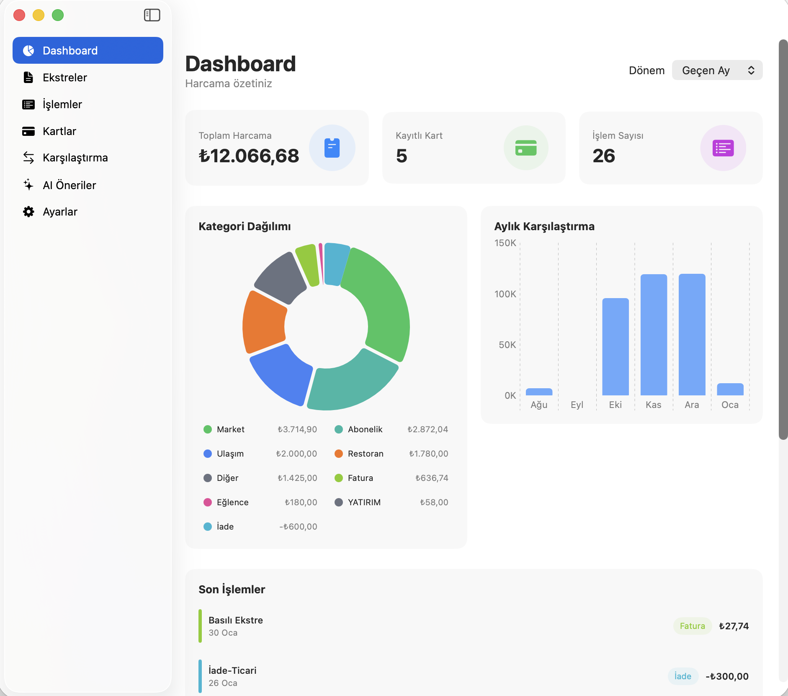
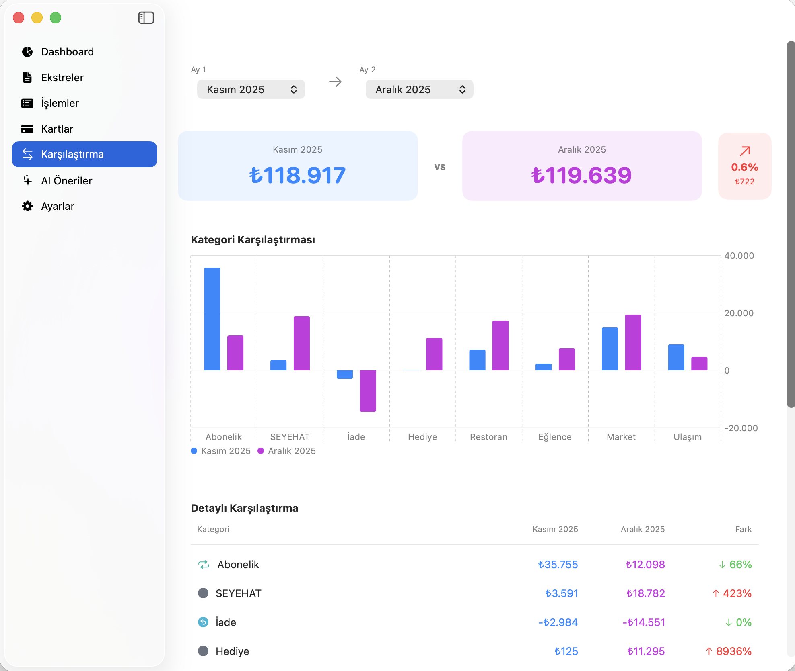

# FinansApp

macOS için kredi kartı ekstre analiz uygulaması. AI destekli PDF okuma ile harcamalarınızı otomatik kategorize edin ve analiz edin.

## Hızlı Başlangıç (Hazır İndir)

Derlemek istemiyorsanız, hazır derlenmiş versiyonu indirin:

1. [Releases](https://github.com/fikret/FinansApp/releases/latest) sayfasından `FinansApp.zip` dosyasını indirin
2. Zip dosyasını açın
3. `FinansApp.app` dosyasını `/Applications` klasörüne sürükleyin
4. Uygulamayı açın (ilk açılışta sağ tıklayıp "Aç" seçin)
5. [Google AI Studio](https://aistudio.google.com/app/apikey)'dan ücretsiz API anahtarı alın
6. Anahtarı uygulamaya girin ve ekstre PDF'lerinizi yüklemeye başlayın!

> **Not**: macOS Gatekeeper uyarısı çıkarsa, System Settings > Privacy & Security'den uygulamaya izin verin.

## Özellikler

- **PDF Ekstre Okuma**: Kredi kartı ekstrelerini AI ile otomatik analiz (OpenAI GPT-4o veya Google Gemini)
- **Kategori Bazlı Analiz**: Harcamalarınızı kategorilere göre görüntüleyin
- **Dashboard**: Pasta ve bar grafikleri ile görsel analiz
- **Ay Ay Karşılaştırma**: İki ayı seçip detaylı karşılaştırma yapın
- **Toplu İşlem Düzenleme**: Birden fazla işlemi seçip kategori değiştirin veya silin
- **Özel Kategoriler**: Kendi kategorilerinizi oluşturun
- **CSV Dışa Aktarma**: Verilerinizi CSV formatında dışa aktarın

## Ekran Görüntüleri

### Dashboard


### Ay Karşılaştırma


## Kurulum

### Gereksinimler

- macOS 14 (Sonoma) veya üzeri
- Swift 5.9+
- OpenAI veya Google Gemini API anahtarı

### Derleme

```bash
# Repository'yi klonlayın
git clone https://github.com/fikret/FinansApp.git
cd FinansApp

# Derleyin
swift build -c release

# Uygulamayı /Applications'a kurun
cp .build/release/FinansApp FinansApp.app/Contents/MacOS/FinansApp
cp -r FinansApp.app /Applications/
```

### Çalıştırma (Geliştirme)

```bash
swift run
```

## Kullanım

1. Uygulamayı ilk açtığınızda onboarding ekranı sizi karşılar
2. AI servisi seçin (Gemini önerilir) ve API anahtarınızı girin
3. İlk kredi kartı ekstrenizi PDF olarak yükleyin
4. AI otomatik olarak işlemleri çıkaracak ve kategorize edecek
5. Dashboard'dan harcamalarınızı analiz edin

## API Anahtarı Alma

### Google Gemini (Önerilen)
1. [Google AI Studio](https://aistudio.google.com/app/apikey) adresine gidin
2. "Create API Key" butonuna tıklayın
3. Anahtarı kopyalayıp uygulamaya yapıştırın

### OpenAI
1. [OpenAI Platform](https://platform.openai.com/api-keys) adresine gidin
2. "Create new secret key" butonuna tıklayın
3. Anahtarı kopyalayıp uygulamaya yapıştırın

## Veri Depolama

- Veritabanı: `~/Library/Application Support/FinansApp/finans.db` (SQLite)
- API anahtarları: UserDefaults (sistem anahtarlığı)

## Teknolojiler

- **SwiftUI** - UI framework
- **Swift Charts** - Grafikler
- **SQLite3** - Yerel veritabanı
- **OpenAI API** - GPT-4o vision
- **Google Gemini API** - Gemini 2.0 Flash

## Desteklenen Kategoriler

Market, Restoran, Ulaşım, Giyim, Teknoloji, Sağlık, Eğlence, Fatura, Abonelik, Eşya, Kırtasiye, İade, Diğer

Ayrıca kendi özel kategorilerinizi de ekleyebilirsiniz.

## Lisans

MIT License

## Yazar

Fikret Tozak - [fikret.tozak@wpokulu.co](mailto:fikret.tozak@wpokulu.co)

Bu program Claude Code kullanılarak geliştirilmiştir.
